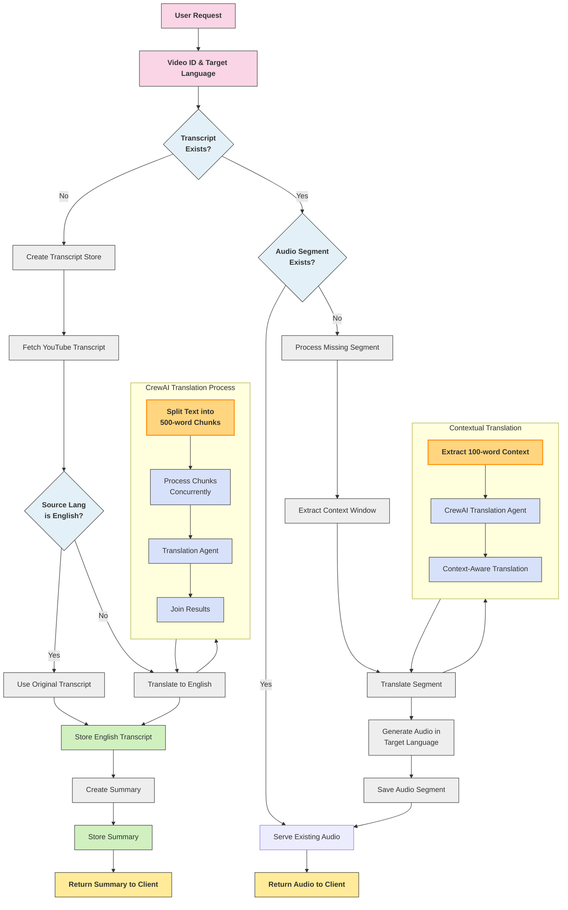

## Setup Instructions

1. Create a virtual environment:

```bash
python -m venv env

## How to run

In the backend folder, run the main.py file to start the server, then load the frontend folder as a chrome extension (Manage extensions -> Load unpacked -> then browse and select the extension folder in the frontend folder)

## System Architecture

This application transforms YouTube videos into multilingual audio/text content using a combination of transcript extraction, translation, and audio generation.

### Flowchart

The following flowchart illustrates the system's architecture and data flow:



### Key Components

- **Transcript Extraction**: YouTube transcripts are extracted using YouTube Transcript API
- **Translation System**: CrewAI agents handle translation with contextual awareness
- **Context-Aware Processing**: 
  - Large texts are split into 500-word chunks for efficient processing
  - Each segment uses a 100-word context window for accurate translation
- **Audio Generation**: Edge TTS converts translated text to natural-sounding speech
- **Caching System**: Processed segments are stored for future requests

### Chrome Extension

- The extension provides a user interface overlay for YouTube videos, allowing users to interact with the translation and language learning features
- Features a popup interface that detects when users are on a YouTube video page
- Includes buttons for fetching english transcript, creating real-time translations, and generating summary and notes
- Implements a sync system that highlights transcript lines as the video plays, helping users follow along
- Contains a language selection form where users can specify their target language for translation
- Features an audio playback system that retrieves translated audio segments from the backend server and plays them in real time with the current video timestamp
- Implements proper error handling for various scenarios like missing transcripts or connectivity issues
- Caches transcript data locally to improve performance for repeated operations
- Requires proper permissions in the manifest file, including access to YouTube domains and scripting capabilities

### Supported Languages

The system supports translation and audio generation for multiple languages, including English, Hindi, Spanish, French, German, Japanese, Korean, Chinese, and more.

## API Endpoints

### Video Content
- `/show_transcript/<video_id>`: Returns full transcript with timestamps
  - **Response**: JSON with transcript segments including start/end times
  
- `/show_data/<video_id>`: Retrieves video metadata
  - **Response**: JSON with title, channel, duration, and other metadata

- `/concise_summary/<video_id>`: Gets AI-generated concise summary
  - **Response**: JSON with `concise_summary` field

- `/notes/<video_id>`: Retrieves AI-generated structured notes
  - **Response**: JSON with `notes` field

- `/listen_audio/<video_id>/<target_language>/<segment_number>`: Gets translated audio segment
  - **Parameters**: target_language (e.g., "es"), segment_number (index)
  - **Response**: Audio file of translated segment

### Interactive Q&A
- `/precompute/<video_id>`: Prepares video data for Q&A
  - **Response**: JSON indicating success/failure

- `/process`: Processes a query about video content
  - **Method**: POST
  - **Body**: `{"query": "...", "video_id": "...", "addition_mode": false}`
  - **Response**: JSON with answer, video title, and channel

